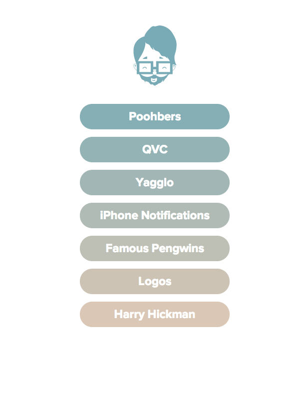

# Random Gradient Generator

This generates two random colors, and figures out the difference of those colors based on the number of elements that you specify. This will create a gradient that is individually applied to each element.

*Here is an example*

--- 

## Using it
**Setting the number of steps**
Simply replace *.menuitem* with the element or class you want to apply the gradient to:
`var $colorElement = $('.menuitem'),`
    `steps = $colorElement.length+1;`

**Picking colors**
The random colors are generate with the *generate_rgb()* function. I'm not 100% sure how this is actually choosing color ranges. This current setup *Math.floor(Math.random()\*128)+100* gives me very pleasing colors to work with. I have tried multiple combinations, for instance, *Math.floor(Math.random()\*256)* was giving me much darker colors and *Math.floor(Math.random()\*128)+127)* was giving me very lite pastel-like colors.

I'm still researching this, but feel free to enlighten me.

**Using with an SVG Image**
All you need to do is specify your *svg* image as the last parameter:
`add_color(color_mixer(generate_rgb(), generate_rgb()),$('svg path'));`

**Using without an SVG Image**
Remove the *$svg* parameter from the *add_color()* function:
`var add_color = function(mixed, $svg)`

---
## Use as you wish
I'm a beginner when it comes to programming. I've probably made lot's of stupid mistakes in this code, but I'm learning and it's really fun :) I would love for someone to improve this so that I can learn even more! Hooray for learning!